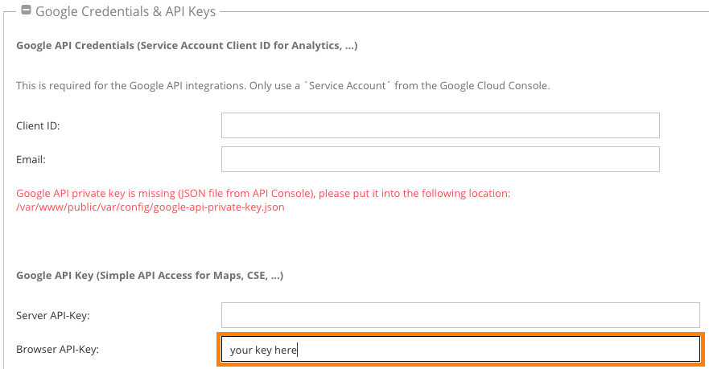

# Elements Overview

## Accordion / Tab
Create an accordion or tab element.
It's possible to change the layout from accordion to tabs without loosing the content.

### Available Options

| Name | Type | Description | Default Value | Frontend
|------|------|-----------------------------|---------------|-------------------------------|
| `type` | select | Choose accordion type | panel-default | `pimcore_select('type')` |
| `component` | select | Choose the component type | accordion | `pimcore_select('component')` |
| `additional_classes` | select | Add custom classes | - | see [section additional classes](#additional-classes) |

## Anchor
Create an anchor element.

### Available Options

| Name | Type | Description | Default Value | Frontend
|------|------|-----------------------------|---------------|-------------------------------|
| `anchor_name` | input | Set the anchor name | - | `pimcore_input('anchor_name')` |
| `anchor_title` | input | Set the anchor title | - | `pimcore_input('anchor_title')` |

## Columns

Create (nested) columns.

### Configuration

By default, the toolbox will transform the stored values into bootstrap grid values.
If you're using a different grid system, you probably need to change the [grid calculation](30_ToolboxTheme.md).

**Note:** If you're changing the column amount during a layout change, the nested content may gets lost depending on the new column amount

- Changing from 3 columns to 2 columns: the content of the third column gets lost.
- Changing from 2 columns to 4 columns: the content of the first two columns stays the same.

### Available Options

| Name | Type | Description | Default Value | Frontend
|------|------|-----------------------------|---------------|-------------------------------|
| `type` | select | Set the column type. see example below. | column_6_6 | `pimcore_input('type')` |
| `columnadjuster` | section | This element comes by default after the `type` field. Read more about this feature [here](60_ColumnAdjuster.md) | - | - |
| `equal_height` | checkbox | Appends some equal height classes | false | `pimcore_checkbox('equal_height')` |
| `additional_classes` | select | Add custom classes | - | see [section additional classes](#additional-classes) |

### Column Calculation Example

```yaml
toolbox:
    areas:
        columns:
            config_elements:
                type:
                    config:
                        store:
                            column_8_4: '2 Columns'
```

`column_8_4` will generates two columns:
 
1. column with `col-12 col-sm-8 col-md-8` 
2. column with `col-12 col-sm-4 col-md-4`
 
It's possible, however, to define custom breakpoint classes and also offset elements:

```yaml
toolbox:
    areas:
        columns:
            config_elements:
                type:
                    config:
                        store:
                            column_4_4_4: '3 Columns (33:33:33)'
                            column_o1_4_o1_5:
                                name: '2 Columns (1 Offset, 33%%, 1 Offset, 40%%, 1 Offset)'
                                breakpoints:
                                    xs: o0_12_o0_12
                                    sm: o0_6_o0_6
                                    md: o1_4_o1_5
                                    lg: o1_4_o1_5
                            column_o2_4_o1_3:
                                name: '2 Columns (2 Offset, 33%%, 1 Offset, 25%%, 2 Offset)'
                                breakpoints:
                                    xs: o0_12_o0_12
                                    sm: o1_5_o1_4
                                    md: o1_5_o1_4
                                    lg: o2_4_o1_3
                            column_4_3_o1_3:
                                name: '3 Columns (33%%, 25%%, 1 Offset, 25%%, 1 Offset)'
                                breakpoints:
                                    xs: 12_12_o0_12
                                    sm: 6_6_o0_12
                                    md: 4_4_o0_4
                                    lg: 4_3_o1_3
```

## Container
Create a container element. Useful if you're using a full width layout.

### Available Options

| Name | Type | Description | Default Value | Frontend
|------|------|-----------------------------|---------------|-------------------------------|
| `full_width_container` | checkbox | Adds the `container-fluid` class | false | `pimcore_checkbox('full_width_container')` |
| `additional_classes` | select | Add custom classes | - | see [section additional classes](#additional-classes) |

## Content
Create a wysiwyg editor.

### Available Options

| Name | Type | Description | Default Value | Frontend
|------|------|-----------------------------|---------------|-------------------------------|
| `additional_classes` | select | Add custom classes | - | see [section additional classes](#additional-classes) |


## Download
Create download elements.

> Note: If you're using the [MembersBundle](https://github.com/dachcom-digital/pimcore-members), the download element will automatically check for a restriction.

### Available Options

| Name | Type | Description | Default Value | Frontend
|------|------|-----------------------------|---------------|-------------------------------|
| `downloads` | relations | Add download files / folders | - | `pimcore_relations('downloads')` |
| `show_preview_images` | checkbox | Display Preview Images | false | `pimcore_checkbox('show_preview_images')` |
| `show_file_info` | checkbox | Display File Info | false | `pimcore_checkbox('show_file_info')` |
| `additional_classes` | select | Add custom classes | - | see [section additional classes](#additional-classes) |

### Configuration Parameter
Use the `event_tracker` Parameter to build a helper markup for google events:

**Example**  
```yaml
toolbox:
    areas:
        download:
            config_parameter:
                event_tracker:
                    category: 'PDF'
                    action: 'download'
                    label: ['getMetadata', ['name']]
                    noninteraction: true
```
### View Helper
In `Download/Partial/item.html.twig`, you'll find a `toolbox_download_info()` helper. 
This Twig Extension will generate some download info.

**Usage**:   
```twig

```

**Arguments:**  
1. Asset, Download File
1. Bool, Show Preview Image 
1. String, File Size Unit (mb, kb, optimized). Optimized means: get the best matching unit.
4. File Size Precision: Round Precision

## Gallery
Create image galleries.

### Dependency
The base markup of this gallery element includes some [slick slider](http://kenwheeler.github.io/slick/) standards. 
If you want to use a different extension to generate your galleries, just override the templates or use the change the selector in your javascript call.

### Available Options

| Name | Type | Description | Default Value | Frontend
|------|------|-----------------------------|---------------|-------------------------------|
| `images` | relations | Add images / folders | - | `pimcore_relations('images')` |
| `use_light_box` | checkbox | Add a `light-box` class and a wrapping link | false | `pimcore_checkbox('use_light_box')` |
| `use_thumbnails` | checkbox | Add a thumbnail slider | false | `pimcore_checkbox('use_thumbnails')` |
| `additional_classes` | select | Add custom classes | - | see [section additional classes](#additional-classes) |

## Google Map
Create a Google Map Element. You're able to define one or multiple markers. Toolbox will automatically generate the long/lat information after saving the document.
Please make sure that you've included a valid google maps api key. Include the script tag in your footer:

```html
<script type="text/javascript" src="//maps.googleapis.com/maps/api/js?libraries=places&amp;key={{ toolbox_google_map_api_key() }}"></script>
```

Now head into the pimcore-backend, open systemsettings, navigate to Google Credentials & API Keys and insert the api key for google maps into the browser-api-key-field:



If you made your own toolbox-/googleMap-config, please make sure to add the last line to it:
```yaml
toolbox:
    areas:
        googleMap:
            config_parameter:
                map_api_key: '%pimcore_system_config.services.google.browserapikey%'
```

> Note: like all other systemsettings, this one is also stored in system.php for versioning

> Note: This is a [custom toolbox element](22_GoogleMapsElement.md).

### Available Options

| Name | Type | Description | Default Value | Frontend
|------|------|-----------------------------|---------------|-------------------------------|
| `map_zoom` | numeric | Map Zoom | 12 | `pimcore_numeric('map_zoom')` |
| `map_type` | select | Map Type (ROADMAP, HYBRID ..) | roadmap | `pimcore_select('map_type')` |
| `iw_on_init` | checkbox | Open Info Window by Default | false | `pimcore_checkbox('iw_on_init')` |
| `additional_classes` | select | Add custom classes | - | see [section additional classes](#additional-classes) |

### Configuration Parameter

| Name | Type | Description | Default Value | 
|------|------|-------------|---------------|
| `map_options` | array | Map Zoom | [] |
| `map_style_url` | string | Define a custom map style (path to json) | false |
| `marker_icon` | string | Define a custom marker_icon (path to icon) | false |
| `map_api_key` | string | Set a custom map api key. To extend the daily request to 2.500 per day. This parameter tries to load the browser api key from the system settings! This key is used by frontend-api-requests | `'%pimcore_system_config.services.google.browserapikey%'` |
| `simple_api_key` | string | Set a custom simple api key. To extend the daily request to 2.500 per day. This parameter tries to load the server api key from the system settings! This key is used by backend-api-requests | `'%pimcore_system_config.services.google.simpleapikey%'` |

**Example**  
```yaml
toolbox:
    areas:
        googleMap:
            config_parameter:
                map_options:
                    streetViewControl: true
                    mapTypeControl: false
                    panControl: false
                    scrollwheel: false
                map_style_url: false
                marker_icon: false
                map_api_key: false
                simple_api_key: false
```
### jQuery Plugin
There is also a jquery plugin for the google maps element. Read more about it [here](80_Javascript.md#google-maps-extension)

### Route Link Renderer
There is a macro in `views/Macro/mapLink.html.twig` (used in `views/Theme/GoogleMap/infoWindow.html.twig`) which will render the map route link:

```twig
{# default #}
{{ link_generator.generate(googleMapsHostUrl, mapParams) }}

{# generates #}
{# https://maps.google.ch/?daddr=47.4838827,9.7574593&directionsmode=driving #}
```

```twig
{# use address params #}
{{ link_generator.generate(googleMapsHostUrl, mapParams, false) }}

{# generates #}
{# https://maps.google.ch/?daddr=way+132,666+city,country&directionsmode=driving #}
```

## Headline
Create a headline.

### Available Options

| Name | Type | Description | Default Value | Frontend
|------|------|-----------------------------|---------------|-------------------------------|
| `headline_type` | select | Define the headline size | h3 | `pimcore_select('headline_type')` |
| `anchor_name` | input | Define a anchor name | - | `pimcore_input('anchor_name')` |
| `additional_classes` | select | Add custom classes | - | see [section additional classes](#additional-classes) |


## iFrame
Create an iFrame field.

### Available Options

| Name | Type | Description | Default Value | Frontend
|------|------|-----------------------------|---------------|-------------------------------|
| `url` | input | Set a Url which should be loaded. If the Url is not allowed to implement (Source has a `SAMEORIGIN`, `DENY` entry in `x-frame-options` header) you'll receive an error. | - | `pimcore_input('url')` |
| `iheight` | numeric | Initial Height of the iFrame | 200 | `pimcore_numeric('iheight')` |
| `additional_classes` | select | Add custom classes | - | see [section additional classes](#additional-classes) |

### jQuery Plugin
There is also a jquery plugin for the video element. Read more about it [here](80_Javascript.md#iframe-extension).
We can't provide any out-of-the-box solution for changing the iframe height dynamically (cross-domain policy), so you need to take care about that by yourself.
Possible Solutions to mastering dynamic iFrame heights:

- Define an iFrame height for every breakpoint in your stylesheet.
- Use the plugin events (see iframe javascript extension) and connect it with a plugin like the [iframe-resizer](https://github.com/davidjbradshaw/iframe-resizer).


## Image
Create an image field.

### Available Options

| Name | Type | Description | Default Value | Frontend
|------|------|-----------------------------|---------------|-------------------------------|
| `use_light_box` | checkbox | Add a `light-box` class and a wrapping link | false | `pimcore_checkbox('use_light_box')` |
| `show_caption` | checkbox | Render image caption | false | `pimcore_checkbox('show_caption')` |
| `additional_classes` | select | Add custom classes | - | see [section additional classes](#additional-classes) |


## Link List
Create a link list (via pimcore block element).

### Available Options

| Name | Type | Description | Default Value | Frontend
|------|------|-----------------------------|---------------|-------------------------------|
| `additional_classes` | select | Add custom classes | - | see [section additional classes](#additional-classes) |

## Parallax Container
Build a Parallax Container.

### Available Options

| Name | Type | Description | Default Value | Frontend
|------|------|-----------------------------|---------------|-------------------------------|
| `template` | select | Define a Parallax Template | no-template | `pimcore_select('template')` |
| `background_image` | relation | Define a background image | - | `pimcore_relation('background_image')` |
| `background_color` | select | Define a background color | no-background-color | `pimcore_select('background_color')` |
| `image_front` | parallaximage | Parallax Images behind content | - | *not available* |
| `image_behind` | parallaximage | Parallax Images in front of content | - | *not available* |
| `additional_classes` | select | Add custom classes | - | see [section additional classes](#additional-classes) |

### Configuration Parameter

- Use the `window_size` Parameter to render a larger edit window
- Use the `background_mode` Parameter to define the background mode (wrap, prepend)
- Use the `background_image_mode` Parameter to define the append mode (data, class)
- Use the `background_color_mode` Parameter to define the append mode (data, class)

**Example**  
```yaml
toolbox:
    areas:
        parallaxContainer:
            config_parameter:
                window_size: large
                background_mode: wrap
                background_image_mode: data
                background_color_mode: data
```

## Parallax Container Section

Build a Parallax Container Section.

> Note: This element is only available in a parallax container element.

### Available Options

| Name | Type | Description | Default Value | Frontend
|------|------|-----------------------------|---------------|-------------------------------|
| `template` | select | Define a Parallax Section Template | no-template | `pimcore_select('template')` |
| `container_type` | select | Define a Container Type | none | `pimcore_select('container_type')` |
| `background_image` | relation | Define a background image | - | `pimcore_relation('background_image')` |
| `background_color` | select | Define a background color | no-background-color | `pimcore_select('background_color')` |
| `additional_classes` | select | Add custom classes | - | see [section additional classes](#additional-classes) |

### Configuration Parameter

- Use the `background_image_mode` Parameter to define the append mode (data, class)
- Use the `background_color_mode` Parameter to define the append mode (data, class)

**Example**  
```yaml
toolbox:
    areas:
        parallaxContainerSection:
            config_parameter:
                background_image_mode: data
                background_color_mode: data
```

## Separator
Create a Separator Element (hr)

### Available Options

| Name | Type | Description | Default Value | Frontend
|------|------|-----------------------------|---------------|-------------------------------|
| `space` | select | Add some seperator spacer classes | default | `pimcore_select('space')` |
| `additional_classes` | select | Add custom classes | - | see [section additional classes](#additional-classes) |


## Slide Columns
Create a sliding column element.

### Dependency
We basically designed this element in combination with the [slick slider](http://kenwheeler.github.io/slick/) plugin.
Since we want to avoid specific markup in a most possible way, there are still some references if your looking at the toolbox [backend style](https://github.com/dachcom-digital/pimcore-toolbox/blob/master/src/ToolboxBundle/Resources/public/css/admin.css#L47).
This is just a hint if you're going to use a different javascript extension: Be sure this element works in your backend too. :)

> Note: You need to implement your own javascript logic. Get some hints [here](50_FrontendTips.md).

### Available Options

| Name | Type | Description | Default Value | Frontend
|------|------|-----------------------------|---------------|-------------------------------|
| `slides_per_view` | select | Slides per View | 4 | `pimcore_select('slides_per_view')` |
| `equal_height` | checkbox | Appends some equal height classes | false | `pimcore_checkbox('equal_height')` |
| `additional_classes` | select | Add custom classes | - | see [section additional classes](#additional-classes) |

### Configuration Parameter

- Use the `column_classes` Parameter to define column classes
- Use the `breakpoints` Parameter to define special breakpoint classes

**Example**  
```yaml
toolbox:
    areas:
        slideColumns:
            config_parameter:
                column_classes:
                    '2': 'col-12 col-sm-6'
                breakpoints: []
```

## Spacer
Create a spacer element.

### Available Options

| Name | Type | Description | Default Value | Frontend
|------|------|-----------------------------|---------------|-------------------------------|
| `spacer_class` | select | Spacer classes | spacer-none | `pimcore_select('spacer_class')` |
| `additional_classes` | select | Add custom classes | - | see [section additional classes](#additional-classes) |

## Teaser
Create teaser elements.

### Available Options

| Name | Type | Description | Default Value | Frontend
|------|------|-----------------------------|---------------|-------------------------------|
| `type` | select | Define Teaser Type: direct or as snippet | direct | `pimcore_select('type')`. Read more about below in "Teaser Type" Section. |
| `layout` | select | Define Teaser Layout | default | `pimcore_select('layout')` |
| `use_light_box` | checkbox | Add a `light-box` class and a wrapping link for teaser image | false | `pimcore_checkbox('use_light_box')` |
| `additional_classes` | select | Add custom classes | - | see [section additional classes](#additional-classes) |

### Teaser Types
Like explained above, it's possible to switch between two Types of Teasers:

#### Direct
The `direct` teaser type allows you to place a teaser structure at any place in your document. Just change the options through the edit window.

#### Snippet
Sometimes you want do add teasers in a more reusable way. For that you should use the `snippet` type.
The ToolboxBundle will add a `Teaser Snippet` document type during installation, use it to create teaser elements in snippet context. 
This document type will also add all custom elements (`layout`, `use_light_box`, `additional_classes`) with all given teaser layouts.

> Note: If you're using the `snippet` type, all option fields (`layout`, `use_light_box`, `additional_classes`) will become unavailable in your document.

## Video
Create a Video Element.

> Note: This is a [custom toolbox element](21_VhsElement.md).

### Available Options

| Name | Type | Description | Default Value | Frontend
|------|------|-----------------------------|---------------|-------------------------------|
| `autoplay` | checkbox | Start/Stop Video if it's in a visible viewport | false | `pimcore_checkbox('autoplay')` |
| `additional_classes` | select | Add custom classes | - | see [section additional classes](#additional-classes) |

### Configuration Parameter

- Use the `video_types` Parameter to enable/disable Video Types

**Example**  
```yaml
toolbox:
    areas:
        video:
            config_parameter:
                video_types:
                    asset:
                        active: false
                        allow_lightbox: true
                    youtube:
                        active: true
                        allow_lightbox: true
                    vimeo:
                        active: false
                        allow_lightbox: true
                    dailymotion:
                        active: false
                        allow_lightbox: true
```

### jQuery Plugin
There is also a jquery plugin for the video element. Read more about it [here](80_Javascript.md#video-extension)

# Element Config Field Overview

In short, you're able to use all the [pimcore editables](https://www.pimcore.org/docs/5.0.0/Documents/Editables/index.html).

**Example** 
```yaml
toolbox:
    custom_areas:
        container:
            config_elements:
                awesome_fields:
                    type: input # all the pimcore editables
                    config:
                        # all available configuration attributes from
                        # https://www.pimcore.org/docs/5.0.0/Documents/Editables/Input.html#page_Configuration
```

# Additional Classes

Almost every toolbox element supports the `additionalClasses` field type.
This Element will help you to generate some additional classes for every toolbox element.
This is great since you don't need to override the element view, just add one or more additional classes via config.

> Note: The class gets attached to the `toolbox-*` wrapper element.

## Main Additional Class
To add some

```yaml
toolbox:
    areas:
        headline:
            config_elements:
                additional_classes:
                    type: additionalClasses
                    config:
                        store:
                            white-bg: 'White Background'
```

This will generate a drop-down in your area config field:


> **Note!** You can only use `additionalClasses` once per field.

> **Note!** Name needs to be `additional_classes`.

## Chained Additional Classes
If you need to add more additional classes you need to add one or more fields of type `additionalClassesChained`.

```yml
toolbox:
    areas:
        headline:
            config_elements:
                additional_classes:
                    type: additionalClasses
                    config:
                        store:
                            ac_class_1: 'class 1'
                            ac_class_2: 'class 2'
                            ac_class_3: 'class 3'
                additional_classes_chain_1:
                    type: additionalClassesChained
                    title: 'II. Chained Classes'
                    config:
                        store:
                            chain_one_class_1: 'chain one class 1'
                            chain_one_class_2: 'chain one class 2'
                            chain_one_class_3: 'chain one class 3'
                additional_classes_chain_2:
                    type: additionalClassesChained
                    title: 'III. Chained Classes'
                    config:
                        store:
                            chain_two_class_1: 'chain two class 1'
                            chain_two_class_2: 'chain two class 2'
                            chain_two_class_3: 'chain two class 3'
```

This will generate some drop-downs in your area config field:


> **Note!** You can only use `additionalClassesChained` if there is a configured `additionalClasses` field.

> **Note!** Name needs to be `additional_classes_chain_[INT]` where `[INT]` needs to be numeric.

Now check the toolbox-element, all additional classes are available in the `toolbox-element`:

```html
<div class="toolbox-element toolbox-headline ac_class_1 chain_one_class_2 chain_two_class_3">
 [...]
</div>
```
